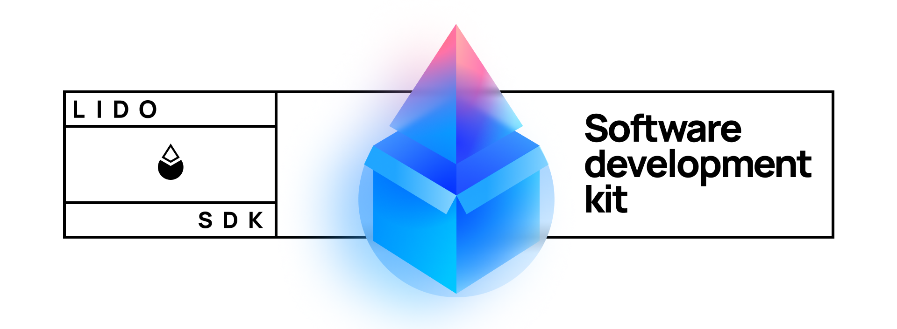

<div style="display: flex;" align="center">
  <h1 align="center">Lido Ethereum SDK</h1>
</div>

<div style="display: flex;" align="center">
  
  
  
  
  
  
  
</div>
<br/>

**Lido Ethereum SDK** is a package that provides convenient tools for interacting with Lido contracts on the Ethereum network through a software development kit (SDK). This SDK simplifies working with Lido contracts and accessing their functionality.

## WIP

The project is currently under development and may change in the future.

## Changelog

For changes between versions see [CHANGELOG.MD](packages/sdk/CHANGELOG.md)

## Migration

## Installation

You can install the Lido Ethereum SDK using npm or yarn:

[Docs SDK package](packages/sdk/README.md)

```bash
// SDK (stakes, wrap, withdrawals)
yarn add @lidofinance/lido-ethereum-sdk
```

## Usage

To get started with the Lido Ethereum SDK, you need to import the necessary modules:

```ts
const { LidoSDK } = require('@lidofinance/lido-ethereum-sdk');

// Or, if you are using ES6+:
import { LidoSDK } from '@lidofinance/lido-ethereum-sdk';

// Or, import separate each module separately to save up on bundle size
import { LidoSDKStake } from '@lidofinance/lido-ethereum-sdk/stake';
```

## Initialization

Before using the SDK, you need to create an instance of the LidoSDK class:

```ts
// Pass your own viem PublicClient

import { createPublicClient, http } from 'viem';
import { goerli } from 'viem/chains';

const rpcProvider = createPublicClient({
  chain: goerli,
  transport: http(),
});
const sdk = new LidoSDK({
  chainId: 5,
  rpcProvider,
  web3Provider: provider, // optional
});
```

```ts
// Or just rpc urls so it can be created under the hood
const sdk = new LidoSDK({
  chainId: 5,
  rpcUrls: ['https://eth-goerli.alchemyapi.io/v2/{ALCHEMY_API_KEY}'],
  web3Provider: provider, // optional
});
```

Replace "https://eth-goerli.alchemyapi.io/v2/{ALCHEMY_API_KEY}" with the address of your Ethereum provider.

## Examples

All examples and usage instructions can be found in the [Docs SDK package](packages/sdk/README.md).

```ts
const lidoSDK = new LidoSDK({
  chainId: 5,
  rpcUrls: ['https://eth-goerli.alchemyapi.io/v2/{ALCHEMY_API_KEY}'],
});

// Define default web3 provider in sdk (window.ethereum) if web3Provider is not defined in constructor
lidoSDK.core.defineWeb3Provider();

// Views
const balanceETH = await lidoSDK.core.balanceETH(address);

// Calls
const stakeResult = await lidoSDK.stake.stakeEth({
  value,
  callback,
  referralAddress,
  account,
});

console.log(balanceETH.toString(), 'ETH balance');
console.log(stakeResult, 'stake result');
```

## Migration

For breaking changes between versions see [MIGRATION.md](MIGRATION.md)

## Documentation

For additional information about available methods and functionality, refer to the [the documentation for the Lido Ethereum SDK](packages/sdk/README.md).

## Playground

To check out SDK in action visit [playground](https://lidofinance.github.io/lido-ethereum-sdk/). Or tinker locally by cloning this repo and following [Playground instructions](playground/README.md).
